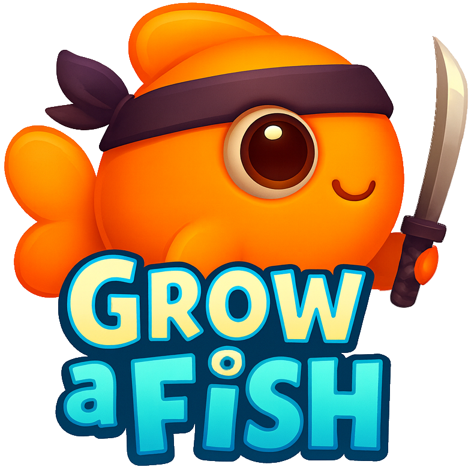
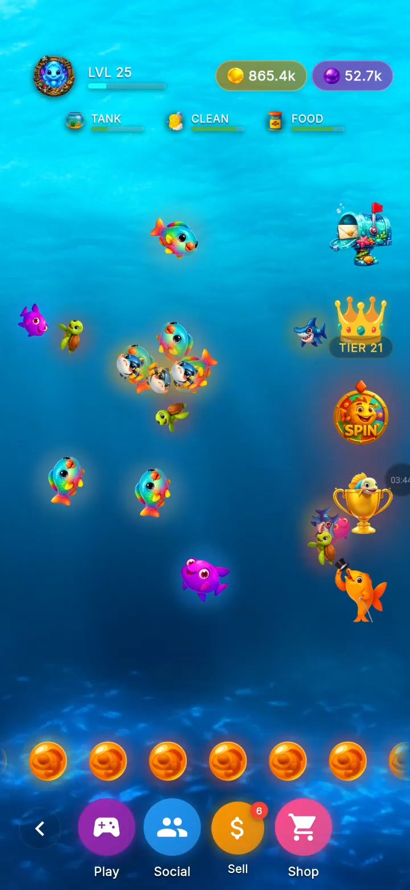
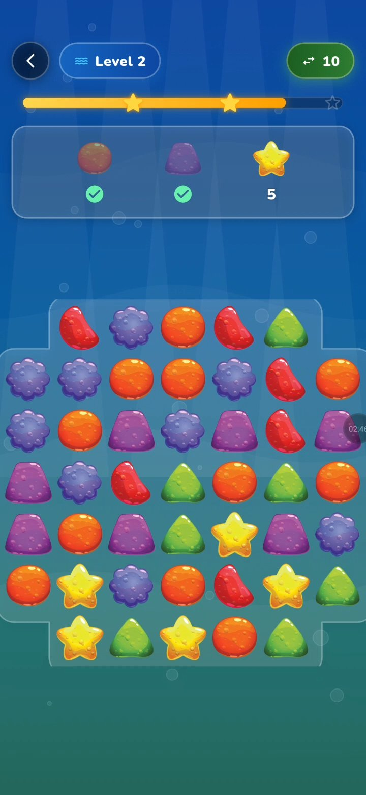
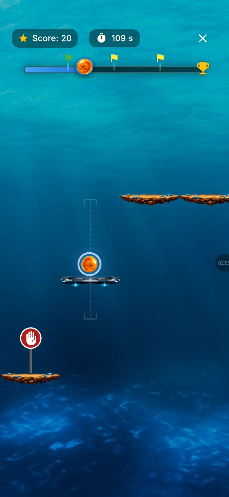
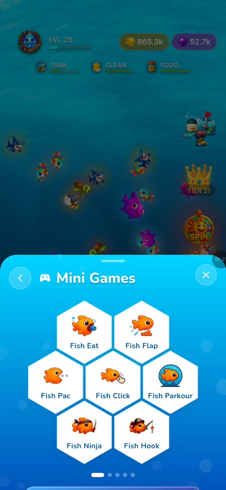
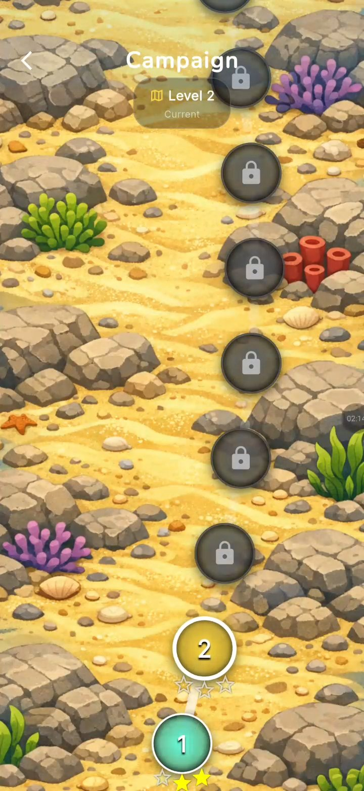
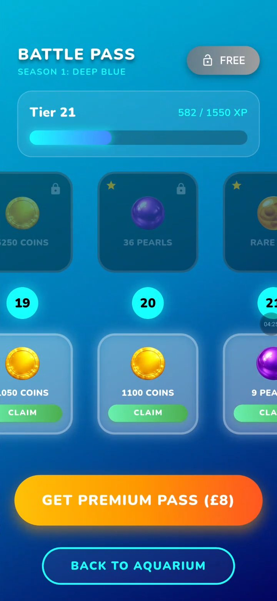
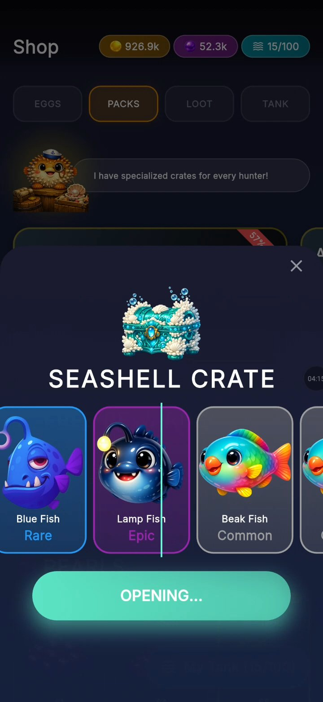
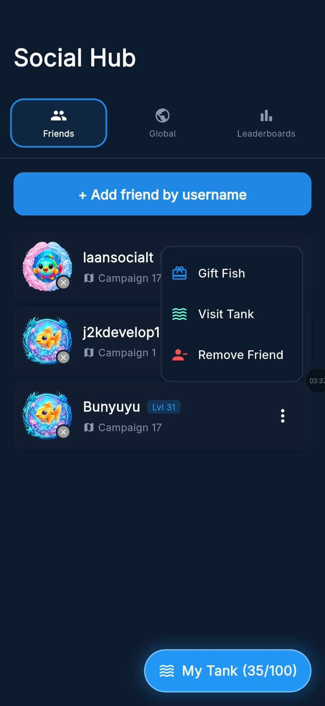
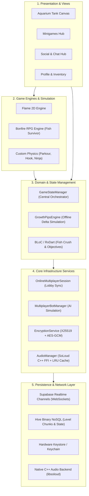

# 🐠 Grow A Fish

<div align="center">



**A Production Cross-Platform Virtual Pet Simulator & Real-Time Multiplayer Arcade Ecosystem**

[](https://play.google.com/store/apps/details?id=com.elomarstudio.growafish)
[](https://play.google.com/store/apps/details?id=com.elomarstudio.growafish)
[](https://flutter.dev)
[](https://flame-engine.org)
[](https://github.com/elomarjc)

<br/>

[🎮 **Play Grow a Fish on Google Play**](https://play.google.com/store/apps/details?id=com.elomarstudio.growafish) • [🌐 **Official Website**](https://growafish.org)

</div>

---

> [!NOTE]
> **Confidentiality & Source Code Notice**
> The production source code of **Grow A Fish** is commercial, proprietary software developed by El-Omar Studio and is hosted in a private repository. This public showcase repository serves as an **engineering case study and technical whitepaper** highlighting the system architecture, algorithms, real-time networking, mobile optimizations, and engineering solutions developed for the game without exposing proprietary production source files.

---

## 🎮 Game Overview

**Grow A Fish** is a full-featured mobile game published on Google Play that blends the relaxed progression of an aquarium virtual-pet simulator with the competitive engagement of multi-genre arcade minigames, social tank visits, and real-time multiplayer competitions.

### Core Gameplay Loop
```
   ┌───────────────────────────────────────────────────────────┐
   │                     1. AQUARIUM CARE                       │
   │  Feed fish • Clean habitat • Monitor health • Cure sickness │
   └──────────────────────────────┬──────────────────────────────┘
                                  │ Earn XP & Growth Pips
                                  ▼
   ┌───────────────────────────────────────────────────────────┐
   │                    2. EVOLUTION & BREEDING                  │
   │   Hatch eggs • Mature from juvenile to adult • Cross-breed  │
   └──────────────────────────────┬──────────────────────────────┘
                                  │ Unlock Perks & Abilities
                                  ▼
   ┌───────────────────────────────────────────────────────────┐
   │                    3. ARCADE & MINIGAMES                    │
   │ Parkour • Vampire Survivor RPG • Match-3 • Ninja • Pac-Fish │
   └──────────────────────────────┬──────────────────────────────┘
                                  │ Coins, Pearls, Artifacts
                                  ▼
   ┌───────────────────────────────────────────────────────────┐
   │                 4. COMPETITION & PROGRESSION                │
   │  Online real-time lobbies • E2EE chat • Battle Pass seasons │
   └──────────────────────────────┬──────────────────────────────┘
                                  │ Decorate & Upgrade Tank
                                  └───────────────► (Loop back)
```

### What Makes The Game Unique
* **Hybrid Game Genre**: Seamlessly integrates a physics-driven, organic virtual aquarium with high-tempo 2D action games (platforming, top-down survival, physics slicing, match-3 puzzles).
* **Deterministic Real-Time Multiplayer**: Instant, low-bandwidth multiplayer lobbies powered by synchronized seed distribution and latency-resilient event dispatching.
* **Security-First Social Layer**: Private 1-on-1 and lobby chat secured with client-side end-to-end encryption (E2EE) powered by X25519 key exchange and AES-256-GCM authenticated ciphers.
* **Low-Latency Native C++ Audio**: Zero-lag game SFX mixing powered by `flutter_soloud` via Dart Foreign Function Interface (FFI), avoiding native Android audio thread starvation.

---

## 📱 Gameplay Showcase

<div align="center">

| 01. Main Aquarium Simulation | 02. Match-3 Campaign |
| :---: | :---: |
|  |  |
| *Real-time physics-driven aquarium ecosystem, feeding & health management* | *Campaign progression with cascading board solver and objective BLoC* |

| 03. Global Navigation & Hub | 04. Multi-Genre Arcade Minigames |
| :---: | :---: |
|  |  |
| *Intuitive navigation hub connecting aquarium, hatchery, and social zones* | *Honeycomb selector for Parkour, Survivor, Ninja, Flap, and Hook games* |

| 05. Level Progression & Campaign | 06. Battle Pass & Reward Tracks |
| :---: | :---: |
|  |  |
| *Dynamic level unlocking, stage milestones, and difficulty scaling* | *Seasonal reward tracks, crate opening loot tables, and currency vaults* |

| 07. Seasonal Events & Hatchery | 08. Social Hub & Leaderboards |
| :---: | :---: |
|  |  |
| *Timed holiday events, rare potion crafting, and exotic fish species* | *Global leaderboards, tank heists, friend gifts, and E2EE encrypted chat* |

</div>

---

## 👨‍💻 My Role

As the **creator, solo architect, and lead software engineer**, I conceived, designed, and engineered the application from scratch:
* **Engine & Game Architecture**: Designed a modular game architecture spanning 330+ Dart modules, combining Flutter UI with Flame and Bonfire 2D game loops.
* **Real-time Networking & Bot AI**: Engineered deterministic multiplayer networking over WebSockets and built simulated bot players for seamless offline/online matchmaking.
* **Cryptographic Architecture**: Designed and implemented hardware-backed client-side E2EE chat using X25519 ECDH and AES-GCM-256.
* **Audio Engineering**: Overcame Android platform audio latency by integrating a native C++ audio engine (`SoLoud`) via Dart FFI with custom LRU caching.
* **Content Tooling & Pipelines**: Built an in-game tile map editor (`FishParkourStudio`) and automated generative AI skin rendering workflows using ComfyUI.
* **Commercial Deployment**: Managed end-to-end release on Google Play, Google Play Billing (IAP), and live operational telemetry.

---

## 🛠️ Technology Stack

| Category | Technology | Purpose & Implementation |
| :--- | :--- | :--- |
| **Languages** | Dart 3.6, C++ (via FFI), SQL | Core client code, low-latency audio interop, relational database schemas. |
| **Game Engines** | **Flame Engine**, **Bonfire RPG** | 2D game loops, sprite sheet animation, collision trees, camera viewport culling. |
| **UI Framework** | **Flutter** (Material 3, Sizer) | Cross-platform reactive UI, custom painters, responsive vector layouts. |
| **Audio Engine** | **Flutter SoLoud** (C++ FFI) | Low-latency hardware audio mixing, concurrent SFX voices, LRU memory cache. |
| **Cryptography** | `cryptography`, `flutter_secure_storage` | **X25519** ECDH key exchange, **AES-256-GCM** authenticated cipher, Android Keystore. |
| **Local Persistence** | **Hive NoSQL**, `shared_preferences` | High-throughput binary serialization for level chunks and offline player profile state. |
| **Cloud & Backend** | **Supabase** (PostgreSQL, Realtime, Auth) | WebSocket channels for lobby events, relational database, Row Level Security (RLS). |
| **Monetization** | `in_app_purchase` (Google Play Billing) | Receipt validation, premium currency packs, consumable potion purchasing. |
| **Generative Pipeline** | **ComfyUI** (Custom Checkpoints) | Algorithmic generation of themed fish species (Cyber, Pixel, Magic, Pirate, Disco). |

---

## 🏗️ Technical Architecture

The application adopts a decoupled, event-driven layered architecture separating real-time game loops from presentation logic, cryptographic services, and network layers:



---

## ⚙️ Deep-Dive Systems & Technical Highlights

### 1. Deterministic Seed-Synchronized Multiplayer
* **The Problem**: Mobile cellular networks suffer from high packet jitter and intermittent packet loss. Continuously streaming player coordinates and obstacle positions in real time leads to rubber-banding and high cloud bandwidth costs.
* **The Solution**: 
  - Instead of streaming world state, the host generates a single **64-bit deterministic PRNG seed** and synchronizes it alongside an epoch start timestamp across the Supabase Realtime channel.
  - Every client executes the exact same deterministic procedural generation algorithm locally. Spikes, platforms, pearls, and power-up locations materialize identically across all devices without transmitting any coordinate data.
  - The network stream only carries lightweight discrete event packets: `player_jump`, `powerup_consumed`, and `player_eliminated`.

```
Host (Room Master) ───[ sendSpawnSeed(seed: 0x7F4A, timestamp: 1725000000) ]───► Supabase Broadcast
                                                                                      │
                               ┌──────────────────────────────────────────────────────┴───────────────┐
                               ▼                                                                      ▼
                       Client A (Local PRNG)                                                  Client B (Local PRNG)
               Generates identical level chunks                                       Generates identical level chunks
```

### 2. Autonomous Multiplayer Bot Simulation (`MultiplayerBotManager`)
* When human player matchmaking times exceed acceptable thresholds or network disconnections occur, the game automatically synthesizes client-side virtual opponents.
* Each bot features dynamic parameterization:
  - `skillLevel` (0.0 to 1.0): Determines obstacle avoidance reflex latency and jump timing variance.
  - `speedMultiplier` (0.8 to 1.2): Simulates player pacing differences.
* Bots integrate directly into the same event broadcast bus as human peers, ensuring single-player and multiplayer code paths remain unified.

### 3. Hardware-Backed End-to-End Encrypted Chat
* **Cryptographic Protocol**:
  1. **Key Generation**: On first launch, the client generates an **X25519** elliptic-curve key-pair. The private key is committed directly into the Android Keystore / iOS Keychain via `flutter_secure_storage`.
  2. **Public Key Exchange**: The public key is published to the public player profile table in Supabase.
  3. **Shared Secret Derivation**: When opening a conversation with a friend, both clients derive a matching symmetric key using Diffie-Hellman:

$$
\text{SharedSecret} = \text{X25519}(\text{PrivateKey}_{\text{self}}, \text{PublicKey}_{\text{peer}})
$$

  4. **Authenticated Payload Encryption**: Every message is encrypted using **AES-256-GCM** with a unique 96-bit initialization vector (nonce):

$$
\text{Ciphertext}, \text{AuthTag} = \text{AES-GCM-256}(\text{Message}, \text{SharedSecret}, \text{Nonce})
$$

  5. **Zero Cloud Visibility**: The Supabase database and WebSocket relay only handle ciphertext and auth tags; plaintexts never exist on any server.

### 4. Native Low-Latency Audio Architecture (Dart FFI & SoLoud)
* **The Problem**: Android's default platform-channel audio solutions incur 50–150ms of audio latency due to inter-process communication (IPC) hops between Dart and native Java/Kotlin, frequently causing audible sound clipping during rapid actions (e.g. slicing in Fish Ninja or collecting coins in Parkour).
* **The Architecture**:
  - Direct integration of `flutter_soloud`, compiling the battle-tested **SoLoud C++ audio library** directly into the Flutter engine via Dart FFI.
  - **Custom LRU Sound Cache**: Bounded at 35 active sound handles to preserve memory.
  - **Pinned Critical Audio**: High-frequency sounds (`hit`, `collect`, `chomp`, `game_over`) are pinned in memory to prevent runtime cache eviction.
  - **Dead-Engine Auto-Recovery**: Detects OS audio device disconnects or buffer under-runs and triggers an automated re-initialization routine with exponential backoff.

### 5. In-Game Level Design Studio & Hive Binary Serialization
* Developed an in-game graphical chunk studio (`FishParkourStudio`) featuring:
  - 12x15 interactive grid matrix for placing terrain, hazards, checkpoints, and coin trails.
  - Direct serialization into `ParkourChunk` models using **Hive NoSQL binary adapters**, yielding sub-millisecond level load times.
  - Role-based access control with lockout timers for administrative level deployment to production game databases.

### 6. Offline Economy & Growth Pips Engine
* Designed a mathematical time-delta progression system (`GrowthPipsEngine`):
  - Instead of keeping a battery-draining background daemon running, the game records verified server/device timestamps upon exit.
  - When resumed, the engine calculates elapsed real-world time, applies non-linear decay curves to tank cleanliness and fish hunger, and awards earned growth pips:

$$
\text{Progress} = \min\left(1.0, \frac{\text{CurrentPips}}{\text{MaturityThreshold}}\right)
$$

---

## ⚡ Performance & Mobile Optimizations

1. **Zero Garbage Collection Audio**: Audio triggers bypass the Dart VM garbage collector by leveraging C++ memory pools via FFI.
2. **Chunked Viewport Culling**: In platformer and survivor modes, game components outside the visible screen matrix are culled from physics calculations and rendering loops.
3. **Multi-Tier Asset Loading**: Assets are segmented into essential bundles (loaded at cold start) and dynamic on-demand bundles (loaded only when entering specific minigames).
4. **Binary Serialization vs JSON**: Critical gameplay chunks use binary Hive buffers rather than JSON string decoding, eliminating frame drops during level transitions.

---

## 🏆 Key Engineering Challenges & Solutions

| Challenge | Root Cause | Engineering Solution |
| :--- | :--- | :--- |
| **Android Audio Latency & Clipping** | Android platform channel IPC overhead and JVM garbage collection cycles. | Replaced Java audio players with C++ `SoLoud` through Dart FFI, achieving zero-latency SFX mixing. |
| **Cellular Multiplayer Jitter** | High mobile ping variance causing rubber-banding in competitive runner mode. | Transitioned from continuous coordinate streaming to deterministic seed-based procedural generation with epoch timestamp reconciliation. |
| **Chat Privacy & Trust** | Storing plain text chat messages on backend databases creates privacy vulnerabilities. | Implemented client-side X25519 + AES-256-GCM hardware-backed encryption; servers only relay encrypted payloads. |
| **Content Scalability** | Hand-crafting 100+ platformer levels inside JSON text files was error-prone and slow. | Engineered a visual in-game level studio with immediate testing, binary Hive persistence, and cloud publishing. |

---

## 💡 What I Learned

* **Game Engine Architecture in Flutter**: Deepened practical expertise in integrating real-time game engines (Flame, Bonfire) inside declarative reactive UI frameworks.
* **Applied Cryptography**: Hands-on mastery of asynchronous elliptic-curve Diffie-Hellman key management, secure key isolation in OS hardware security modules (Keystore/Keychain), and authenticated symmetric encryption.
* **Native Interop (Dart FFI)**: Mastered cross-language memory management and foreign function interfaces between Dart and compiled C++ code for hardware-accelerated tasks.
* **Commercial Game Lifecycle**: Gained full-cycle experience navigating Google Play store guidelines, data safety requirements, and live-ops game maintenance.

---

## 🔒 Source Code Confidentiality Notice

The full production source code for **Grow A Fish** is proprietary intellectual property belonging to El-Omar Studio and remains in a private GitHub repository. 

To discuss architectural specifics, technical consultations, or request a guided walkthrough of the system design, feel free to reach out directly:

* **Developer**: Jacob El-Omar
* **GitHub**: [@elomarjc](https://github.com/elomarjc)
* **Google Play Store**: [Grow A Fish on Google Play](https://play.google.com/store/apps/details?id=com.elomarstudio.growafish)
